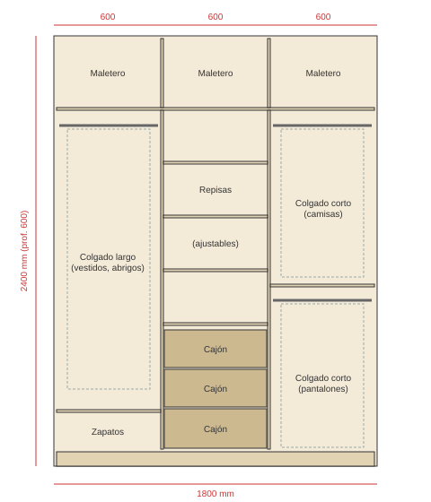

# Clóset para cuarto con materiales Madecentro

Diseño de un clóset de **1,80 m de ancho × 2,40 m de alto × 0,60 m de fondo**, hecho con
tableros y herrajes que vende [Madecentro](https://madecentro.com) y pensado para
pedir el **corte y el enchape de cantos en la misma tienda** y armarlo en casa.

> ⚠️ **Sobre los precios:** no pude abrir madecentro.com desde el entorno donde se
> hizo este documento (bloqueo de red), así que los precios de abajo son
> **estimaciones de referencia del mercado colombiano** y **no** precios
> confirmados de Madecentro. Cotiza en la tienda o en la web con la lista de
> cortes antes de comprar.

---

## 1. Lo que ofrece Madecentro (relevante para un clóset)

| Línea | Qué hay | Detalles útiles |
|---|---|---|
| [Tableros de melamina](https://madecentro.com/collections/tableros-de-melamina) | Aglomerado melamínico **RH** (resistente a la humedad) Pelíkano, Primadera, Kronospan | Formato **2,15 × 2,44 m**. Espesores 6, 9, 12, **15, 18**, 25, 30, 36 mm. Colores: blanco, blanco nevado, plomo, ceniza, miel, caramelo, rovere, duna, tívoli, macadamia (sincrónico), agave, ártiko, toquilla, mallado, náutico… |
| [Tableros (MDF, HDF, etc.)](https://madecentro.com/collections/tableros) | MDF, HDF/fondo, triplex | HDF de 3 mm para fondos y bases de cajón |
| [Cantos](https://madecentro.com/collections/cantos) | Flexibles, rígidos y semirrígidos, PVC/ABS | Calibres **19, 22, 33, 41 mm**; por metro o rollo de 200 m, en los mismos colores de los tableros |
| [Corte de láminas](https://madecentro.com/pages/corte-de-laminas) | Servicio de corte a medida | Se cobra por lámina con escala según número de piezas (16–25, 26–35, 36–50, 51–100, +100) |
| [Enchape de cantos](https://madecentro.com/pages/enchape-de-cantos) | Pegado de canto en máquina | Rígido o flexible, en punto de venta |
| [Bisagras](https://madecentro.com/collections/bisagras) | Cazoleta 35 mm, recta / semicodo / codo, **cierre lento clip-on**, 45° y 90° esquineras | Cierre lento “high quality”, ~4 kg por par |
| [Rieles de cajón](https://madecentro.com/collections/herrajes-rieles-de-cajon-extension-total-cierre-lento) | Costado metálico, montaje bajo, extensión total, **cierre lento** | Acero cold rolled galvanizado, de 30 a 55 cm |
| [Herrajes para clóset](https://madecentro.com/collections/closets) | **Tubo ovalado 15×30 mm** (cromado o negro, 3 m), soportes laterales y centrales (zamak niquelado, plástico negro, kits) | También [colgadores y elevadores](https://madecentro.com/collections/colgadores-de-ropa) (“pantógrafo”) |
| [Sistemas corredizos](https://madecentro.com/collections/aluminios-sistemas-corredizos) | **M52** (tablero 15–36 mm), **Cordobesa** (15–18 mm, negro), **Amazonas**, **Colgate** (colgante) | Rieles superior/inferior de 2 y 3 m |
| [Herrajes y ferretería](https://madecentro.com/collections/herrajes-y-ferreteria) | Manijas, botones, cerraduras, patas, rodachines, tornillería, conectores | — |
| [Catálogos](https://madecentro.com/pages/catalogos) | PDF de tableros Pelíkano, cantos, herrajes | Descargables |

---

## 2. Distribución propuesta

Tres columnas de 60 cm + maletero arriba:

| Columna | Uso | Contenido |
|---|---|---|
| **A** (izq.) | Colgado largo | Tubo a ~1,85 m, repisa para zapatos a 30 cm del piso |
| **B** (centro) | Doblado | 4 repisas regulables + **3 cajones** con riel de extensión total cierre lento |
| **C** (der.) | Colgado doble | Tubo a ~1,85 m + repisa a 1,00 m + tubo a ~0,90 m (camisas arriba, pantalones abajo) |
| Maletero | Maletas, cobijas | 3 compartimentos de 40 cm de alto con puertas propias |

**Cerramiento recomendado:** 3 puertas batientes de piso a maletero + 3 puertas
de maletero, con bisagras de cazoleta cierre lento. Es lo más fácil de armar y
lo más barato.
*Alternativa:* 2 puertas corredizas con sistema **M52** o **Cordobesa** (ahorra
espacio frente al clóset si el cuarto es pequeño, pero cuesta más y exige un
fondo total de ~65 cm).

---

## 3. Materiales

- **Estructura:** melamina **RH 15 mm** (blanco o color claro por dentro → se ve mejor la ropa).
- **Frentes (puertas):** melamina **RH 15 mm** en color madera (ej. rovere, macadamia, miel) o igual a la estructura.
- **Fondo y bases de cajón:** HDF 3 mm.
- **Cantos:** PVC 22 mm × 0,45 mm en estructura; 22 mm × 1–2 mm (rígido) en puertas.

> ¿15 o 18 mm? 15 mm es lo estándar en Colombia y suficiente con repisas de 58 cm.
> Si vas a poner mucho peso en las repisas o prefieres más rigidez, sube a 18 mm
> (las medidas internas cambian 3 mm por tablero).

---

## 4. Lista de cortes (para llevar a Madecentro)

Medidas en mm, largo × ancho. “Canto” = lados a enchapar (L = lado largo, C = lado corto).

### Melamina RH 15 mm — color estructura (≈ 3 láminas)

| # | Pieza | Cant. | Medida | Canto |
|---|---|---|---|---|
| 1 | Lateral | 2 | 2400 × 560 | 1L |
| 2 | Techo / piso / repisa maletero | 3 | 1770 × 560 | 1L |
| 3 | División vertical (columnas) | 2 | 1875 × 560 | 1L |
| 4 | División maletero | 2 | 400 × 560 | 1L |
| 5 | Repisa (A:1, B:4, C:1) | 6 | 580 × 540 | 1L |
| 6 | Zócalo frontal | 1 | 1770 × 80 | 1L |
| 7 | Costado de cajón | 6 | 450 × 180 | 1L |
| 8 | Frente/fondo interno de cajón | 6 | 525 × 180 | 1L |
| 9 | Frente exterior de cajón (va dentro del clóset) | 3 | 555 × 220 | 2L + 2C |

### Melamina RH 15 mm — color puertas (1 lámina)

| # | Pieza | Cant. | Medida | Canto |
|---|---|---|---|---|
| 10 | Puerta principal | 3 | 1900 × 597 | 2L + 2C |
| 11 | Puerta maletero | 3 | 405 × 597 | 2L + 2C |

### HDF 3 mm (2 láminas)

| # | Pieza | Cant. | Medida |
|---|---|---|---|
| 12 | Fondo del clóset | 1 | 2400 × 1800 |
| 13 | Base de cajón | 3 | 555 × 450 |

> Los cajones quedan **detrás de la puerta B**: monta los rieles retrocedidos ~40 mm
> del borde frontal para que el frente del cajón no choque con las bases de las bisagras.

**Metros de canto aprox.:** ~33 m color estructura + ~23 m color puertas (incluye 10 % de desperdicio).

---

## 5. Herrajes

| Herraje | Cant. | Nota |
|---|---|---|
| Bisagra cazoleta 35 mm cierre lento, **recta** | 14 | Puertas A y C (5 por puerta alta + 2 por puerta de maletero) |
| Bisagra cazoleta 35 mm cierre lento, **semicodo** | 7 | Puerta B, que se apoya sobre una división |
| Riel extensión total cierre lento **45 cm** | 3 pares | Cajones de la columna B |
| Tubo ovalado 15×30 mm × 3 m | 1 | Se corta en 3 tramos de ~578 mm |
| Soporte lateral para tubo ovalado | 6 | 2 por tramo |
| Manija o botón | 9 | 6 puertas + 3 cajones (o perfil uñero) |
| Pin / soporte de repisa 5 mm | 24 | 4 por repisa regulable |
| Tornillo para aglomerado 4 × 40 mm (o minifix) | ~150 | Ensamble de carcasa y cajones |
| Tornillo 3,5 × 16 mm | ~100 | Bisagras, rieles, soportes |
| Puntilla / grapa para fondo | 1 caja | Fijar HDF |
| Escuadras o soporte anti-volteo | 2 | **Anclar el clóset a la pared** (seguridad) |

---

## 6. Presupuesto estimado (COP, referencia — verificar en Madecentro)

| Concepto | Estimado |
|---|---|
| 4 láminas melamina RH 15 mm (3 estructura + 1 color) | $1.050.000 – $1.450.000 |
| 2 láminas HDF 3 mm | $110.000 – $170.000 |
| Servicio de corte (4–5 láminas) | $80.000 – $150.000 |
| Canto + enchape (~56 m) | $150.000 – $260.000 |
| Bisagras cierre lento (21) | $120.000 – $250.000 |
| Rieles cierre lento 45 cm (3 pares) | $90.000 – $180.000 |
| Tubo + soportes | $40.000 – $80.000 |
| Manijas, pines, tornillería, anclajes | $80.000 – $200.000 |
| **Total aproximado** | **≈ $1,7 – $2,7 millones** |

Formas de bajar el costo: todo en blanco (el blanco suele ser la melamina más
barata), botones sencillos, bisagras sin cierre lento, rieles de costado sencillos.
Para subirlo de nivel: puertas corredizas, luz LED con sensor, colgador
pantógrafo en el maletero, organizador de corbatas/cinturones.

---

## 7. Pasos para ejecutarlo

1. **Mide el espacio real** (ancho, alto y fondo en 3 puntos; usa la medida menor).
   Deja 10–15 mm de holgura en alto y ancho. Si cambia, ajusta la lista de cortes.
2. Elige colores en la tienda o en la web (lleva una muestra de piso/pared).
3. Lleva la **lista de cortes** a Madecentro y pide **corte + enchape**. Si la
   tienda tiene servicio de diseño/optimización, pide que optimicen el despiece.
4. Arma la carcasa en el piso (acostada), clava el fondo para escuadrarla, y
   luego levántala.
5. Instala divisiones, repisa del maletero, repisas, tubos y cajones.
6. **Ancla el clóset a la pared.**
7. Instala las puertas y calibra las bisagras (tienen tornillos de ajuste en 3 ejes).

### Alturas de referencia
- Tubo colgado largo: 1,80–1,90 m (vestidos/abrigos necesitan ~1,50 m libres).
- Colgado doble: tubo superior ~1,85 m, inferior ~0,90 m (camisas ~95 cm, pantalones doblados ~70 cm).
- Repisas para ropa doblada: 25–35 cm entre sí.
- Fondo útil mínimo para colgar: 55 cm.

---

**Fuentes:** [Tableros de melamina](https://madecentro.com/collections/tableros-de-melamina) ·
[Tablero blanco RH Primadera](https://madecentro.com/products/tablero-aglomerado-melamina-blanco-rh-primavera) ·
[Pelíkano RH 18 mm](https://madecentro.com/products/tablero-aglomerado-melamina-plomo-rh-pelikano-18-mm) ·
[Cantos](https://madecentro.com/collections/cantos) ·
[Corte de láminas](https://madecentro.com/pages/corte-de-laminas) ·
[Enchape de cantos](https://madecentro.com/pages/enchape-de-cantos) ·
[Bisagras cierre lento](https://madecentro.com/collections/cierre-lento) ·
[Rieles cierre lento](https://madecentro.com/collections/herrajes-rieles-de-cajon-extension-total-cierre-lento) ·
[Herrajes para clóset](https://madecentro.com/collections/closets) ·
[Sistemas corredizos](https://madecentro.com/collections/aluminios-sistemas-corredizos) ·
[Catálogos](https://madecentro.com/pages/catalogos)
