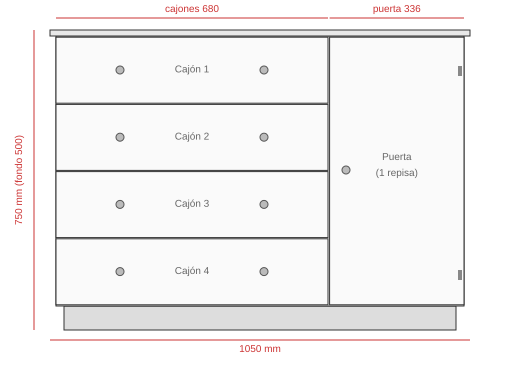

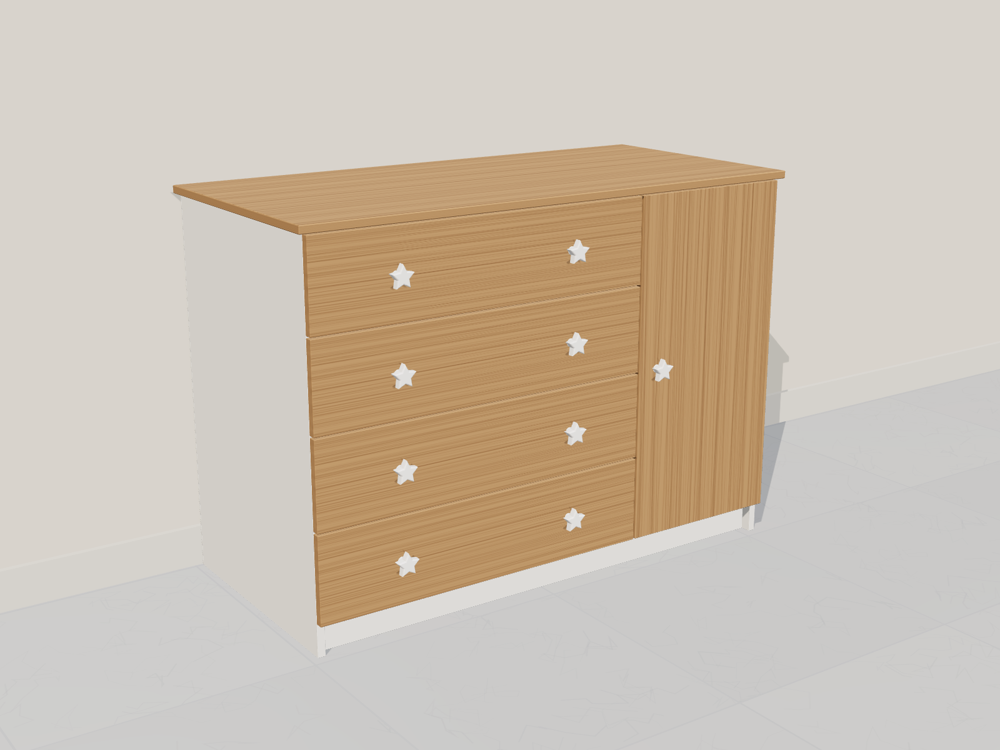

# Cómoda de 4 cajones + puerta (105 × 75 × 50 cm) con materiales Madecentro

Réplica mejorada de la cómoda blanca de las fotos: **4 cajones a la izquierda y
una puerta con repisa a la derecha**. Medidas exteriores **1050 mm de ancho ×
750 mm de alto × 500 mm de fondo**.

> ⚠️ Los precios son **estimados de referencia**, no precios confirmados de
> Madecentro (no se pudo abrir madecentro.com desde el entorno de trabajo).
> Cotiza con esta lista de cortes antes de comprar.

## Renders e infografía

| Cerrada | Abierta | Despiece |
|---|---|---|
|  |  |  |

| Frente | Variante madera |
|---|---|
|  |  |

Los renders son un modelo 3D a escala real hecho con la lista de cortes
(`fuente/scene.html`, Three.js; vistas con `?view=hero|open|exploded|front|color`).
La infografía se genera desde `fuente/infografia.html`.

## Qué mejorar respecto a la cómoda actual

En las fotos se ven los problemas típicos de un mueble económico:

- **Cajones descolgados y desalineados** (el 3.º y el 4.º): probablemente usan
  correderas plásticas o de rodachín que se gastan. → Aquí se usan **rieles
  metálicos de extensión total** (con cierre lento opcional).
- **Base del costado derecho “comida”** por la humedad del trapeado: el
  aglomerado quedó sin canto en el borde que toca el piso. → Tablero **RH** y
  **canto también en el borde inferior** de los costados, y zócalo retrocedido.
- Frentes de cajón que rozan entre sí. → Holgura de **3 mm** entre frentes.

> 💡 Si la carcasa actual está sana, una opción mucho más barata es **solo
> cambiar los rieles** de los 4 cajones (4 pares de 45 cm) y enchapar el borde
> dañado.

## Diseño

| Parte | Detalle |
|---|---|
| Sobre (tapa) | 1050 × 500, sobresale 15 mm a cada lado y 20 mm al frente |
| Carcasa | 1020 × 735 × 480 mm |
| Zócalo | 60 mm de alto, retrocedido 20 mm |
| Columna de cajones | 660 mm libres por dentro, 4 cajones de 165 mm de frente |
| Columna de puerta | 315 mm libres por dentro, 1 repisa regulable |
| Material | Melamina **RH 15 mm blanca** (Pelíkano, Primadera…) + fondo HDF 3 mm |

## Lista de cortes (para Madecentro)

Medidas en mm (largo × ancho). Canto: L = lado largo, C = lado corto.

### Melamina RH 15 mm blanca — cabe en **1 lámina** de 2,15 × 2,44 m

| # | Pieza | Cant. | Medida | Canto |
|---|---|---|---|---|
| 1 | Sobre | 1 | 1050 × 500 | 2L + 2C |
| 2 | Costado (lateral) | 2 | 735 × 480 | 1L (frente) + 1C (abajo) |
| 3 | Piso | 1 | 990 × 480 | 1L |
| 4 | División vertical | 1 | 660 × 480 | 1L |
| 5 | Repisa (columna puerta) | 1 | 315 × 460 | 1L |
| 6 | Travesaño superior (frente y atrás) | 2 | 990 × 80 | 1L el del frente |
| 7 | Zócalo | 1 | 990 × 60 | 1L |
| 8 | Frente de cajón | 4 | 680 × 165 | 2L + 2C |
| 9 | Puerta | 1 | 669 × 336 | 2L + 2C |
| 10 | Costado de cajón | 8 | 450 × 120 | 1L (arriba) |
| 11 | Frente/fondo interno de cajón | 8 | 604 × 120 | 1L (arriba) |

Son 30 piezas de melamina (escala de corte “26–35 piezas”). El despiece está
calculado para caber en una lámina, pero queda justo: pide a Madecentro que lo
optimice y, si no cabe, que te cotice un retal extra.

### HDF 3 mm blanco — 1 lámina

| # | Pieza | Cant. | Medida |
|---|---|---|---|
| 12 | Fondo del mueble | 1 | 1020 × 735 |
| 13 | Base de cajón | 4 | 634 × 450 |

**Canto PVC blanco 22 mm:** ~30 m (incluye desperdicio).

## Herrajes

| Herraje | Cant. | Nota |
|---|---|---|
| Riel de extensión total **45 cm** (ideal cierre lento) | 4 pares | Cajón de 634 mm de ancho exterior para riel de 12,7 mm por lado |
| Bisagra cazoleta 35 mm **recta** (cierre lento) | 2 | Van en el costado derecho, que la puerta cubre completo |
| Pomo / manija | 9 | 2 por cajón + 1 en la puerta (puedes reutilizar las estrellas actuales) |
| Pin de repisa 5 mm | 4 | |
| Tornillo para aglomerado 4 × 40 mm | ~50 | Carcasa y cajones |
| Tornillo 3,5 × 16 mm | ~50 | Rieles y bisagras |
| Puntillas o grapas | 1 caja | Fondo y bases de cajón |
| Escuadra anti-volteo | 1 | **Fijar a la pared**: con niños, una cómoda con cajones abiertos se puede voltear |

## Presupuesto estimado (COP — verificar en Madecentro)

| Concepto | Estimado |
|---|---|
| 1 lámina melamina RH 15 mm blanca | $230.000 – $320.000 |
| 1 lámina HDF 3 mm | $55.000 – $85.000 |
| Corte (26–35 piezas) | $25.000 – $50.000 |
| Canto + enchape (~30 m) | $75.000 – $140.000 |
| 4 pares de rieles 45 cm | $70.000 (sencillos) – $240.000 (cierre lento) |
| 2 bisagras | $8.000 – $25.000 |
| Pomos, pines, tornillería, anclaje | $30.000 – $90.000 |
| **Total aproximado** | **≈ $500.000 – $950.000** |

## Armado

1. Arma los 4 cajones: costados por fuera, frente/fondo interno por dentro,
   base de HDF clavada por debajo. Comprueba que queden a escuadra.
2. Carcasa: piso entre los costados a 60 mm del suelo, división a 660 mm libres
   del costado izquierdo, travesaños arriba. Clava el fondo de HDF (escuadra el mueble).
3. Atornilla el zócalo retrocedido y luego el sobre por dentro, desde los travesaños.
4. Instala los rieles: primero el cajón de abajo, dejando 3 mm entre frentes.
   Atornilla los frentes exteriores al cajón desde dentro.
5. Instala la puerta, ajusta las bisagras y pon la repisa.
6. **Ancla la cómoda a la pared.**

## Variantes fáciles

- **Más ancha / más alta:** cambia solo las medidas de los costados, el piso, la
  división y los frentes; los cajones siguen la misma lógica.
- **Color:** sobre y frentes en madera (rovere, macadamia) con carcasa blanca.
- **Sobre más grueso:** pídelo en 25–30 mm o doble de 15 mm para que se vea más robusto.
