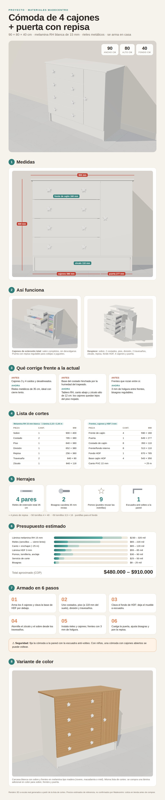
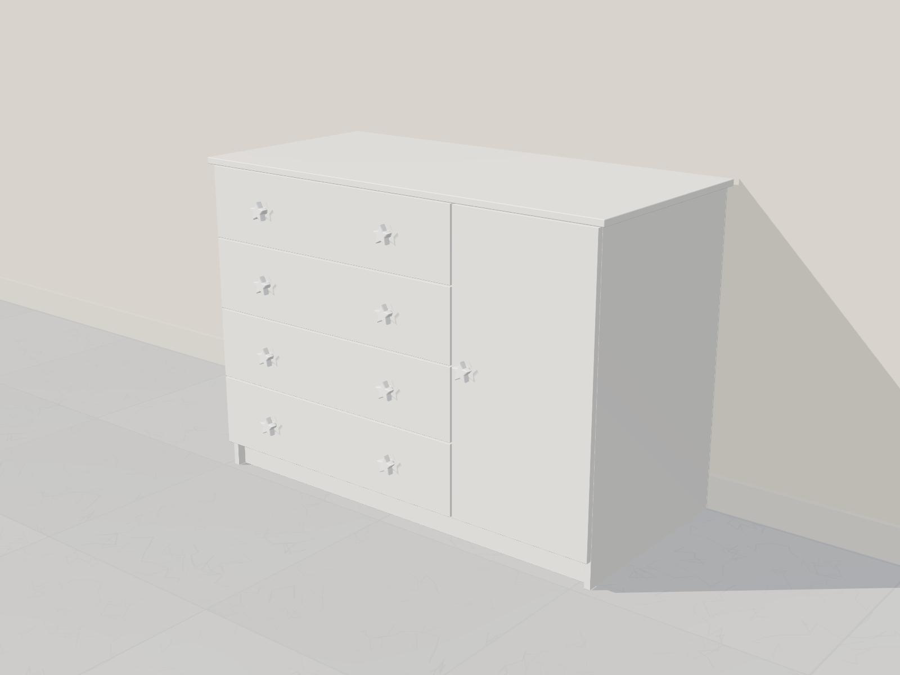
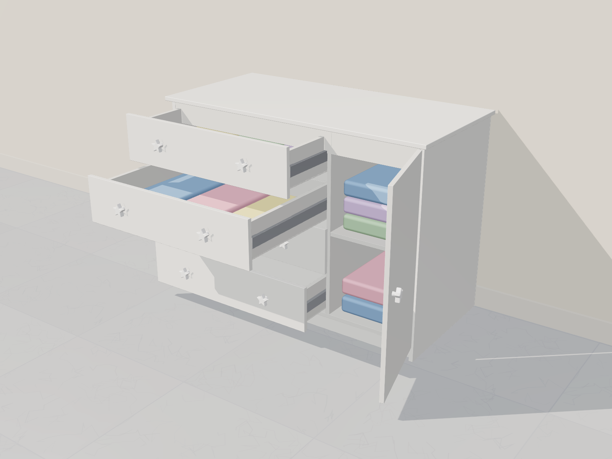
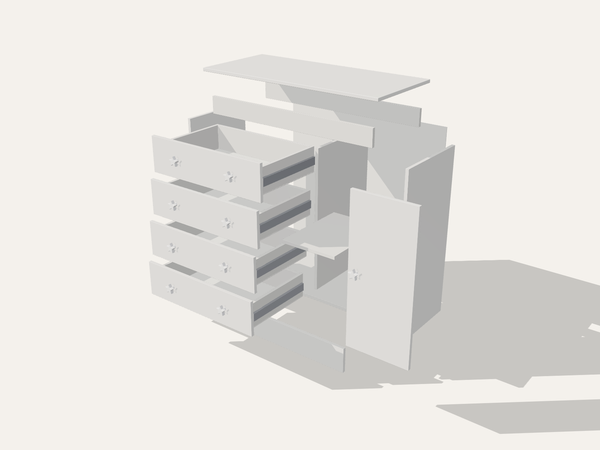
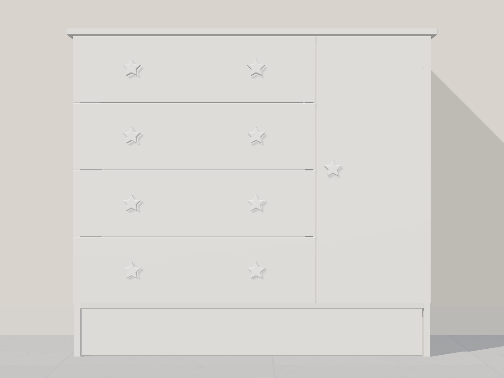
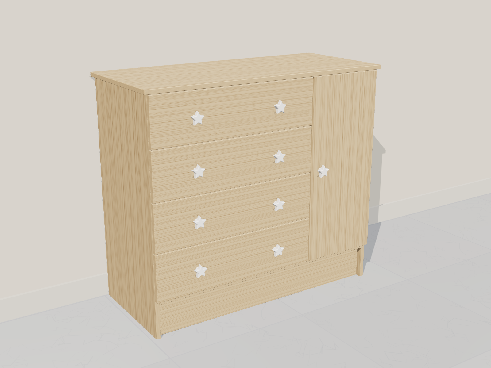

# Cómoda de 4 cajones + puerta (90 × 80 × 40 cm) con materiales Madecentro

> 📘 **Manual completo de corte y armado (PDF):** [manual-armado/manual-corte-y-armado.pdf](../manual-armado/manual-corte-y-armado.pdf)
> — incluye compra, plano de corte con IDs, cantos, perforaciones y armado paso a paso.
> Cambio de diseño: los travesaños superiores van **acostados** bajo el sobre y la división mide **637 mm**.

Réplica mejorada de la cómoda blanca de las fotos: **4 cajones a la izquierda y
una puerta con repisa a la derecha**. Medidas exteriores **900 mm de ancho ×
800 mm de alto × 400 mm de fondo**, con **frentes de cajón de 590 × 160 mm**.

> 💲 Los precios de las **láminas de melamina** son los de madecentro.com
> (capturas de sept. 2026). El resto (HDF, corte, canto, herrajes) siguen siendo
> **estimados de referencia**: confírmalos en la tienda.

> 🛏️ **Cómoda + mesa de noche en 1 sola lámina de 2,15 × 2,44 m** (mismo color):
> ver el plano de cortes en [mesa-noche-madecentro](../mesa-noche-madecentro/README.md).

## Renders

| Cerrada | Abierta | Despiece |
|---|---|---|
|  |  |  |

| Frente | Variante Cartagena |
|---|---|
|  |  |

Los renders son un modelo 3D a escala real hecho con la lista de cortes
(`fuente/scene.html`, Three.js; vistas con `?view=hero|open|exploded|front|color`).
La infografía se genera desde `fuente/infografia.html`.

## Qué mejorar respecto a la cómoda actual

- **Cajones descolgados y desalineados** (el 3.º y el 4.º): probablemente usan
  correderas plásticas que se gastan. → **Rieles metálicos de extensión total**
  de 35 cm (con cierre lento opcional).
- **Base del costado derecho “comida”** por la humedad del trapeado. → Tablero
  **RH**, **canto también en el borde inferior** de los costados y **zócalo de
  118 mm** retrocedido: los cajones quedan lejos del piso mojado.
- Frentes que rozan entre sí. → Holgura de **3 mm** entre frentes.

> 💡 Si la carcasa actual está sana, una opción mucho más barata es **solo
> cambiar los rieles** de los 4 cajones y enchapar el borde dañado.

## Diseño

| Parte | Detalle |
|---|---|
| Sobre (tapa) | 900 × 400, sobresale 15 mm a cada lado y 20 mm al frente |
| Carcasa | 870 × 785 × 380 mm |
| Cajones | 4 frentes de **590 × 160 mm**, 3 mm de holgura entre ellos |
| Puerta | 277 × 649 mm, 1 repisa regulable adentro |
| Zócalo | 118 mm de alto, retrocedido 20 mm |
| Material | Melamina **RH 15 mm blanca** + fondo HDF 3 mm |

**¿Por qué el zócalo mide 118 mm?** Con 4 frentes de 16 cm y 80 cm de alto
total, el espacio que sobra queda abajo. Eso aleja los cajones del piso, que
es donde se dañó la cómoda actual. Si prefieres un zócalo bajo (~6 cm), los
frentes tendrían que ser de **~17,5 cm**; avísame y recalculo.

Columnas por dentro: cajones **569 mm** libres, puerta **256 mm** libres.

## Lista de cortes (para Madecentro)

Medidas en mm (largo × ancho). Canto: L = lado largo, C = lado corto.

### Melamina RH 15 mm blanca — cabe en **1 lámina de 1,83 × 2,44 m** (la más barata)

Despiece verificado en franjas a lo largo de 2440 mm (sierra de 4 mm):

| Franja (alto) | Piezas | Largo usado |
|---|---|---|
| 400 mm | sobre + piso + repisa + 3 costados de cajón | 2350 mm |
| 380 mm | 2 costados + división + 1 costado de cajón | 2348 mm |
| 649 mm | 4 frentes + puerta + 8 frentes/fondos internos + 4 costados de cajón | 2305 mm |
| 118 mm | zócalo | 844 mm |
| 80 mm | 2 travesaños | 1688 mm |

Alto total usado ≈ 1650 mm de 1830 mm: queda margen para el refilado del
tablero. Si en la tienda no cabe con su optimizador, usa la de 2,15 × 2,44 m.

| # | Pieza | Cant. | Medida | Canto |
|---|---|---|---|---|
| 1 | Sobre | 1 | 900 × 400 | 2L + 2C |
| 2 | Costado (lateral) | 2 | 785 × 380 | 1L (frente) + 1C (abajo) |
| 3 | Piso | 1 | 840 × 380 | 1L |
| 4 | División vertical | 1 | **637** × 380 | 1L |
| 5 | Repisa (columna puerta) | 1 | 256 × 360 | 1 borde de 256 (frente) |
| 6 | Travesaño superior acostado (frente y atrás) | 2 | 840 × 80 | 1L el del frente |
| 7 | Zócalo | 1 | 840 × 118 | 1L |
| 8 | Frente de cajón | 4 | 590 × 160 | 2L + 2C |
| 9 | Puerta | 1 | 649 × 277 | 2L + 2C |
| 10 | Costado de cajón | 8 | 350 × 110 | 1L (arriba) |
| 11 | Frente/fondo interno de cajón | 8 | 513 × 110 | 1L (arriba) |

30 piezas (escala de corte “26–35 piezas”).

### HDF 3 mm blanco — 1 lámina

| # | Pieza | Cant. | Medida |
|---|---|---|---|
| 12 | Fondo del mueble | 1 | 870 × 785 |
| 13 | Base de cajón | 4 | 543 × 350 |

**Canto PVC blanco 22 mm:** ~25 m (incluye desperdicio).

## Herrajes

| Herraje | Cant. | Nota |
|---|---|---|
| Riel extensión total carga media 38 kg (Mobile, desde $5.917 el par) **35 cm** | 4 pares | Cajón de 543 mm de ancho exterior para riel de 12,7 mm por lado |
| Bisagra cazoleta cierre lento **parche** (Bonuit, $3.137 el par) | 1 par | Van en el costado derecho, que la puerta cubre completo |
| Pomo / manija | 9 | 2 por cajón + 1 en la puerta (puedes reutilizar las estrellas actuales) |
| Pin de repisa 5 mm | 4 | |
| Tornillo de ensamble 6 × 2" (caja × 100, $6.419) | ~50 | Carcasa y cajones |
| Tornillos para rieles y bisagras | — | Vienen incluidos (12 por par) |
| Puntillas o grapas | 1 caja | Fondo y bases de cajón |
| Cantonera 19 × 12 mm ($296) + taco y tornillo a la pared | 2 | **Fijar a la pared**: con niños, una cómoda con cajones abiertos se puede voltear |

## Presupuesto estimado (COP — verificar en Madecentro)

| Concepto | Estimado |
|---|---|
| 1 lámina melamina blanca RH Primadera **1,83 × 2,44** (precio web, −4 %) | **$226.756** |
| 1 lámina HDF 3 mm | $55.000 – $85.000 |
| Corte (26–35 piezas) | $25.000 – $50.000 |
| Canto + enchape (~25 m) | $65.000 – $120.000 |
| 4 pares de rieles 35 cm | $65.000 (sencillos) – $220.000 (cierre lento) |
| 2 bisagras (precio web: $1.707 eco – $7.566 c/u) | **$3.414 – $15.132** |
| Pomos, pines, tornillería, anclaje | $30.000 – $90.000 |
| **Total aproximado** | **≈ $470.000 – $807.000** |

### Herrajes vistos en madecentro.com (sept. 2026, con −25 %)

| Producto | Marca | Precio | ¿Sirve para esta cómoda? |
|---|---|---|---|
| Bisagra de cazoleta eco slide on | Mobile | $1.707 c/u | ✅ Opción más barata para la puerta (2 und.) |
| Bisagra de cazoleta slide on 110° | Bonuit | $3.061 – $3.104 c/u | ✅ Mejor calidad, gris o negra |
| Otras bisagras de cazoleta (nombre cortado en la captura) | — | $4.875 y $7.566 c/u | Probablemente clip-on / cierre lento: confirma en la ficha |
| **Costado metálico para cajón MAX bajo** | Bonuit | $82.237 – $85.340 por cajón | ⭐ Opción premium (ver abajo) |
| Otro producto de la misma línea (nombre no visible) | Bonuit | $31.033 – $46.549 | Confirma qué es antes de contarlo |
| Push to open con imán / con enganche uña | Bonuit | $3.030 / $3.026 | Solo para la **puerta**, si quieres quitarle el pomo |
| Canto semirrígido **alto brillo** 22 mm × 1 mm, rollo 20 m (blanco, blanco metálico, latte, gris meteoro) | Rehau | $175.912 | ❌ **No lo necesitas** (ver nota) |

**Cajones: dos caminos**

1. **Económico (recomendado):** cajón de melamina como en la lista de cortes +
   rieles telescópicos de 35 cm. Total ≈ **$470.000 – $807.000**.
2. **Premium: Bonuit MAX bajo.** Es un sistema de cajón con costados metálicos y
   riel incorporado (extensión total y cierre suave). Con 4 cajones cuesta
   $328.948 – $341.360 en lugar de los rieles, y el total queda en
   ≈ **$734.000 – $928.000**. Si lo eliges, **no se cortan** los 8 costados de
   cajón de melamina. La base y la trasera del cajón se cortan con las medidas
   de la **ficha técnica Bonuit** para un largo nominal de 350 mm y 569 mm de
   ancho interior. Pídela en la tienda antes del corte.

**Nota sobre el canto Rehau alto brillo:** es para tableros MDF alto brillo. En
melamina mate se ve distinto, el rollo trae 20 m (a esta cómoda le faltarían
unos 5 m) y cuesta $175.912. Es más barato pedir el **servicio de enchape**
con el canto PVC del mismo color de la melamina: Madecentro lo cobra por metro
y ya lo pega en máquina.

**Push to open:** sirve para la puerta. En los cajones choca con los rieles
de cierre lento, porque para eso se usan rieles *push open* especiales. Para
una cómoda infantil, los pomos de estrella siguen siendo lo más práctico.

### Precios de láminas vistos en madecentro.com

| Lámina | Formato | Precio |
|---|---|---|
| Aglomerado melamina blanco RH Primadera | 1,83 × 2,44 | $226.756 (antes $236.204) |
| Aglomerado melamina blanco RH Primadera | 2,15 × 2,44 | $266.410 (antes $277.510) |
| Aglomerado melamina **Cartagena RH Pelíkano** | 2,15 × 2,44 | $365.872 |

### Variante Cartagena (toda la cómoda en madera clara)

Cambia la lámina blanca por **1 lámina Cartagena RH Pelíkano** ($365.872) y
pide el **canto en color Cartagena**. Total aproximado **$609.000 – $946.000**.
Ver render 5.

> Combinar carcasa blanca con frentes Cartagena exige comprar **dos** láminas
> (≈ $592.000 solo en melamina), así que sale más caro que hacerla toda en un color.

## Recomendaciones de la ficha Pelíkano

- Es para **interiores**: no debe recibir agua directa. Por eso el canto en el
  borde inferior de los costados y el zócalo alto son importantes al trapear.
- Resiste manchas (tinta, salsas), rayado y disolventes como alcohol: fácil de
  limpiar en un cuarto de niños.
- Está laminado por **ambas caras**, lo que evita que el tablero se tuerza.

## Armado

1. Arma los 4 cajones: costados por fuera, frente/fondo interno por dentro,
   base de HDF clavada por debajo. Comprueba que queden a escuadra.
2. Carcasa: piso entre los costados a 118 mm del suelo, división a 569 mm libres
   del costado izquierdo, travesaños arriba. Clava el fondo de HDF (escuadra el mueble).
3. Atornilla el zócalo retrocedido y luego el sobre por dentro, desde los travesaños.
4. Instala los rieles empezando por el cajón de abajo y deja 3 mm entre frentes.
   Atornilla los frentes exteriores al cajón desde dentro.
5. Instala la puerta, ajusta las bisagras y pon la repisa.
6. **Ancla la cómoda a la pared.**

## Variantes fáciles

- **Color:** toda en Cartagena (render 5). Otros colores Pelíkano de la carta:
  Almendra, Amaretto, Azul Marino, Espresso, Moka, Roble Ahumado, Roble Gris,
  Siena, Cedro, Cerezo, Sangría, Páramo, Acero, Ártiko, Caramelo, Cemento,
  Ceniza, Lino, Olmo, Oxid, White Chic, Blanco, Negro, Sombra, Mango, Plomo,
  Coral, Gris, Manzano, Marfil, Olivo, Rovere, Sopelli, Wengue, Nevado,
  Haya Catedral, Bronce, Miel, Habano y High Gloss (Negro, Beige, Blanco).
  Esa carta es de Novopan Ecuador (2017): **confirma disponibilidad en Colombia**.
  Para un cuarto infantil, Coral, Mango o Azul Marino funcionan bien como
  acento (por ejemplo, solo en los frentes).
- **Zócalo bajo:** frentes de ~17,5 cm y zócalo de 6 cm.
- **Sobre más grueso:** en 25–30 mm o doble de 15 mm para que se vea más robusto.
