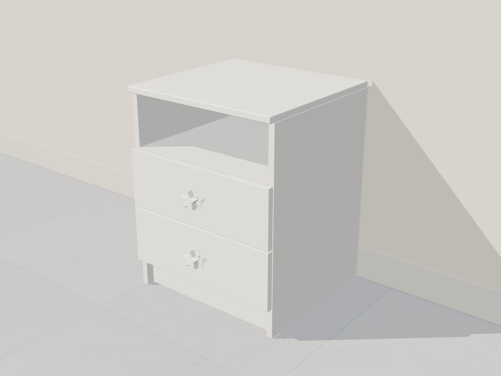
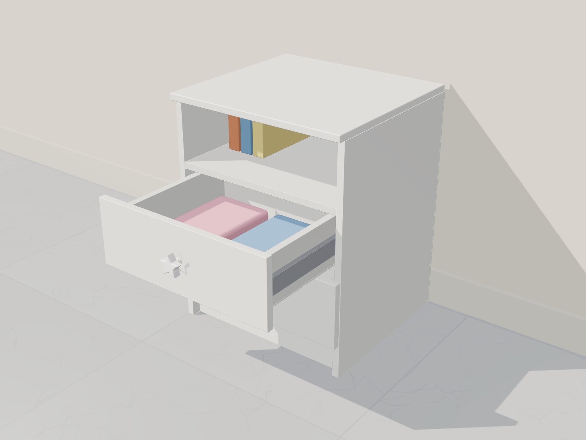
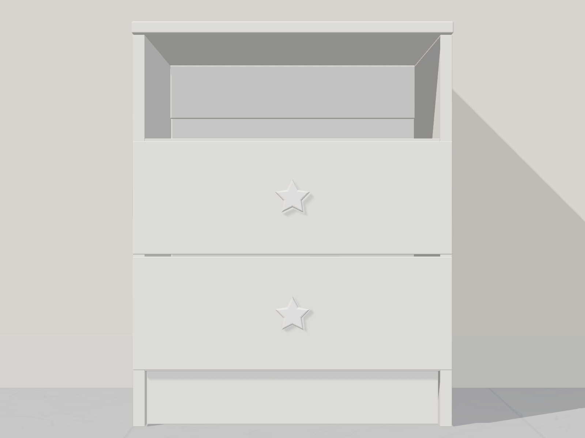
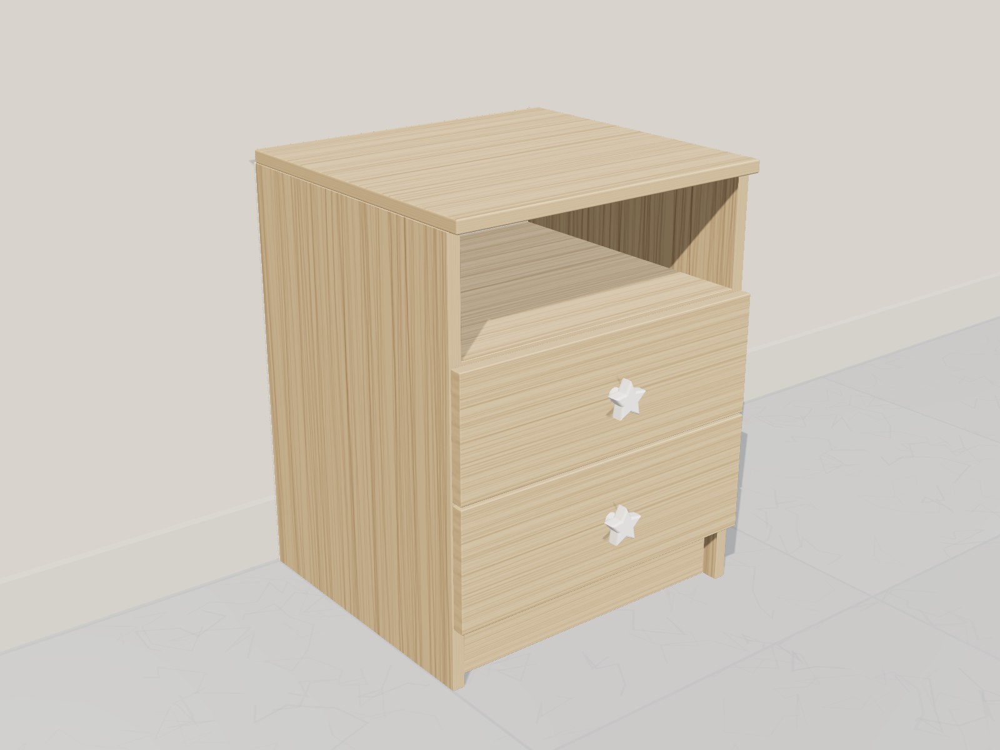
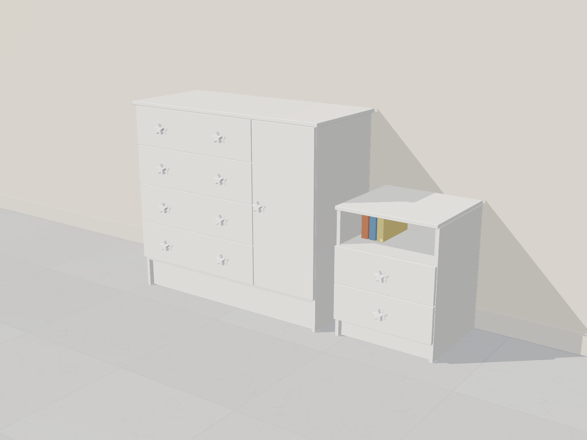
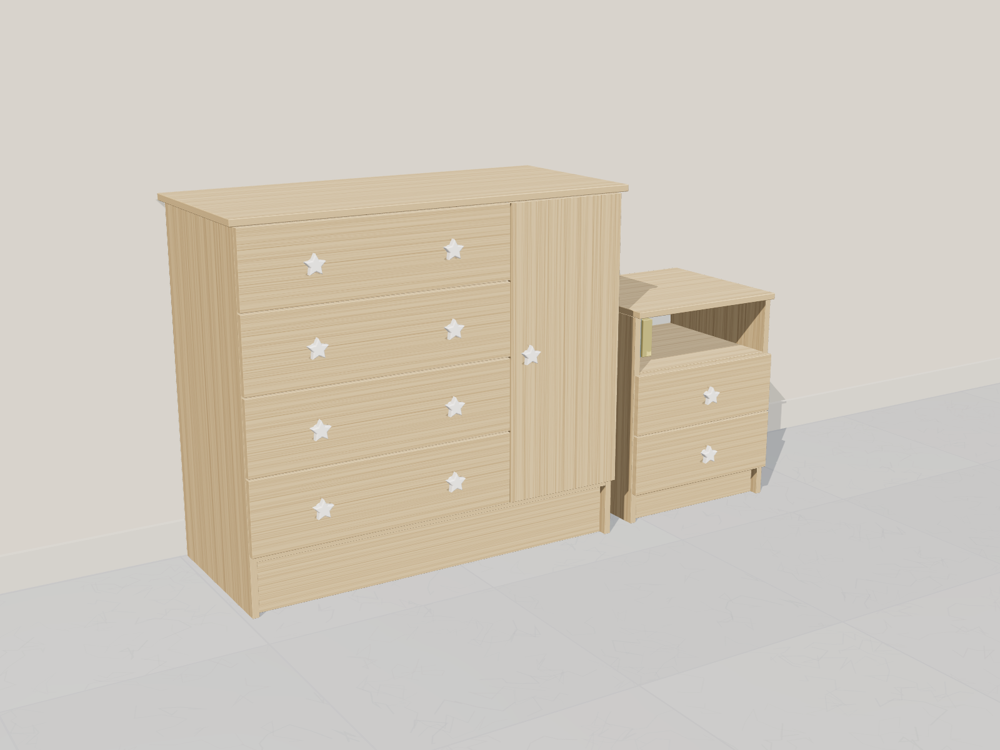
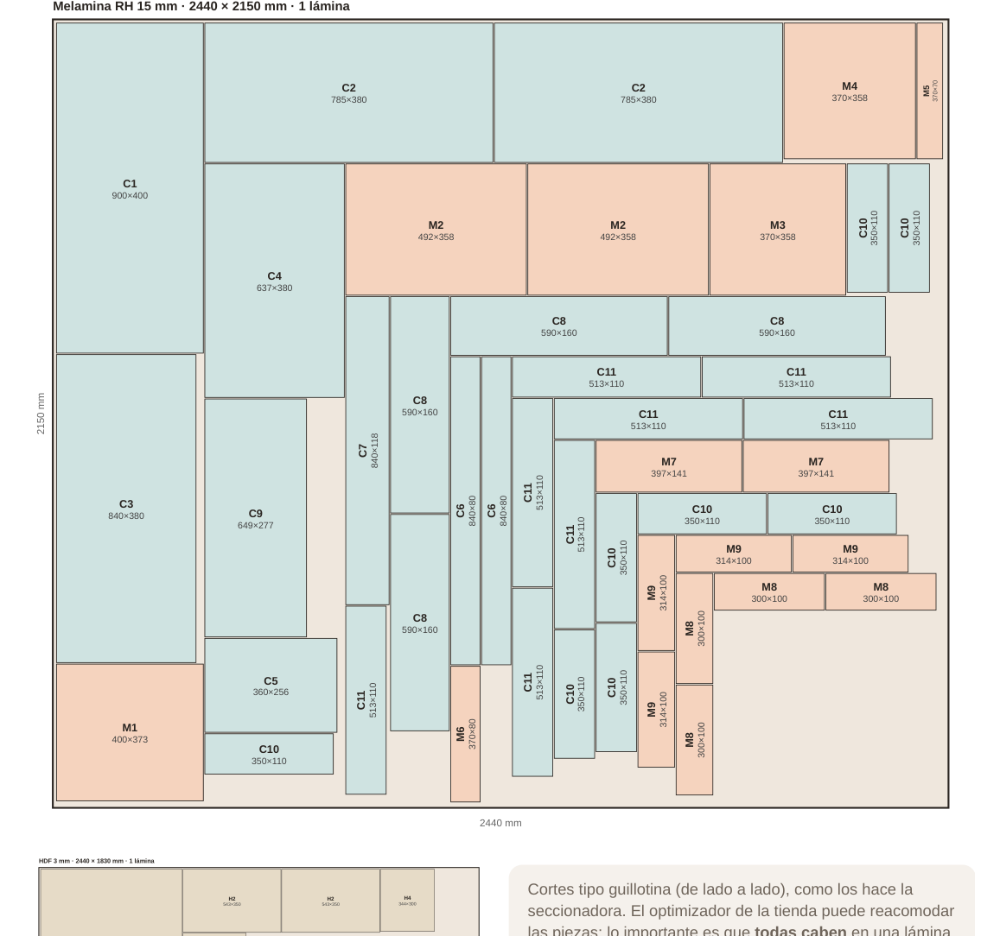

# Mesa de noche 40 × 50,7 × 37,3 cm (juego con la cómoda)

Versión hecha en casa de la **Mesa de Noche Eter** de Bylmo: 2 cajones, un
nicho abierto arriba y zócalo abajo. Usa **las mismas medidas exteriores**
(40 cm de ancho, 50,7 cm de alto y 37,3 cm de fondo), pero el material, los
cantos y los pomos de estrella son los de la
[cómoda](../comoda-madecentro/README.md), para que hagan juego.

> Referencia: la Eter cuesta **$239.900** en Bylmo (antes $382.100) y aparece
> **agotada**. Hecha con el sobrante de la lámina de la cómoda sale más barata
> (ver presupuesto).

| Cerrada | Abierta | Frente |
|---|---|---|
|  |  |  |

| En Cartagena | Juego blanco | Juego Cartagena |
|---|---|---|
|  |  |  |

Renders 3D a escala real: `../comoda-madecentro/fuente/scene.html?model=mesa`
(o `model=set` para ver el juego).

## Diseño

| Parte | Medida |
|---|---|
| Tapa | 400 × 373 mm, al ras con los costados y con el frente de los cajones |
| Nicho abierto (arriba) | 370 mm de ancho × 130 mm de alto libre |
| Cajones | 2 frentes de **397 × 141 mm**, 3 mm de holgura |
| Zócalo | 70 mm, retrocedido 20 mm |
| Material | Melamina RH 15 mm (blanca o Cartagena) + fondo HDF 3 mm |

## Lista de cortes

### Melamina RH 15 mm (del mismo color que la cómoda)

| # | Pieza | Cant. | Medida (mm) | Canto |
|---|---|---|---|---|
| 1 | Tapa | 1 | 400 × 373 | 2L + 2C |
| 2 | Costado | 2 | 492 × 358 | 1L (frente) + 1C (abajo) |
| 3 | Piso | 1 | 370 × 358 | 1L |
| 4 | Repisa del nicho | 1 | 370 × 358 | 1L |
| 5 | Zócalo | 1 | 370 × 70 | 1L |
| 6 | Travesaño trasero | 1 | 370 × 80 | — |
| 7 | Frente de cajón | 2 | 397 × 141 | 2L + 2C |
| 8 | Costado de cajón | 4 | 300 × 100 | 1L (arriba) |
| 9 | Frente/fondo interno de cajón | 4 | 314 × 100 | 1L (arriba) |

### HDF 3 mm (del mismo HDF de la cómoda)

| # | Pieza | Cant. | Medida (mm) |
|---|---|---|---|
| 10 | Fondo | 1 | 400 × 492 |
| 11 | Base de cajón | 2 | 344 × 300 |

**Canto:** ~10 m más.

## Compra: **1 sola lámina** para cómoda + mesa de noche

| Lámina | Cantidad | Precio web |
|---|---|---|
| Melamina RH 15 mm **2,15 × 2,44 m** (el mismo color para los dos muebles) | **1** | $266.410 blanca / $365.872 Cartagena |
| HDF 3 mm | **1** | fondos y bases de cajón de ambos |

Las **47 piezas** (30 de la cómoda y 17 de la mesa) caben en la lámina con
**1 cm de refilado por borde** y **4 mm de sierra**. Todos los cortes son de
tipo guillotina, como los de la seccionadora de Madecentro, y se aprovecha el
**85 %** de la lámina.

Lleva este plano (`despiece-1-lamina.png`) con las dos listas de cortes y pide
que corten **las dos listas en la misma lámina**. El optimizador de la tienda
puede acomodar las piezas de otra forma; lo importante es que ya está
comprobado que caben. El cálculo está en `despiece.py`.

## Costo aproximado del juego (cómoda + mesa de noche, 1 lámina)

| Concepto | Blanco | Cartagena |
|---|---|---|
| 1 lámina melamina RH 15 mm 2,15 × 2,44 *(precio web)* | $266.410 | $365.872 |
| 1 lámina HDF 3 mm | $55.000 – $85.000 | $55.000 – $85.000 |
| Corte (47 piezas) | $35.000 – $75.000 | $35.000 – $75.000 |
| Canto + enchape (~35 m) | $90.000 – $170.000 | $90.000 – $170.000 |
| Rieles: 4 pares de 35 cm + 2 pares de 30 cm | $95.000 – $330.000 | $95.000 – $330.000 |
| 2 bisagras *(precio web)* | $3.414 – $15.132 | $3.414 – $15.132 |
| Pomos, pines, tornillería, anclaje | $45.000 – $130.000 | $45.000 – $130.000 |
| **Total** | **≈ $590.000 – $1.070.000** | **≈ $690.000 – $1.170.000** |

**Estimado realista en blanco: ≈ $680.000.** Supone rieles sencillos,
bisagras eco y las estrellas actuales como pomos.

Con los cajones metálicos **Bonuit MAX** en la cómoda, súmale unos
$120.000 – $265.000.

Como referencia, solo la mesa Eter de Bylmo cuesta $239.900.

### ¿Cuánto cuesta cada mueble?

La lámina y el HDF se reparten según el área que usa cada mueble: la cómoda
usa el 72 % de la melamina y la mesa el 28 %.

| Mueble | Blanco (rango) | **Blanco realista** | **Cartagena realista** |
|---|---|---|---|
| Cómoda 90 × 80 × 40 | $420.000 – $750.000 | **≈ $480.000** | **≈ $550.000** |
| Mesa de noche 40 × 50,7 × 37,3 | $170.000 – $320.000 | **≈ $200.000** | **≈ $230.000** |
| **Juego completo** | $590.000 – $1.070.000 | **≈ $680.000** | **≈ $780.000** |

El precio de la mesa aplica si sale del sobrante de la lámina de la cómoda.
Si la mesa se hace sola, habría que comprarle una lámina entera, y entonces
sale más cara que la Eter ($239.900).

## Herrajes

| Herraje | Cant. | Nota |
|---|---|---|
| Riel de extensión total **30 cm** | 2 pares | Cajón de 344 mm de ancho exterior |
| Pomo de estrella | 2 | Uno centrado por cajón (o una manija como la Eter) |
| Tornillo 4 × 40 mm | ~24 | |
| Tornillo 3,5 × 16 mm | ~24 | Rieles |

No lleva bisagras ni necesita anclaje a la pared, porque es baja.

## Presupuesto de la mesa (lo que se suma a la cómoda)

| Concepto | Estimado |
|---|---|
| Diferencia lámina 2,15 × 2,44 vs 1,83 × 2,44 (blanca, precio web) | **$39.654** |
| Corte extra (pasa a la escala de 36–50 piezas) | $10.000 – $25.000 |
| Canto + enchape (~10 m) | $25.000 – $50.000 |
| 2 pares de rieles 30 cm | $30.000 – $110.000 |
| 2 pomos + tornillería | $15.000 – $40.000 |
| **Total extra** | **≈ $120.000 – $265.000** |

En Cartagena la lámina **no suma nada**, porque la cómoda en Cartagena ya usa
la lámina de 2,15 × 2,44 y la mesa sale de su sobrante. En ese caso la mesa
cuesta **≈ $80.000 – $225.000**.

## Armado

1. Arma los 2 cajones y clava las bases de HDF por debajo.
2. Une los costados con el piso (a 70 mm del suelo), la repisa del nicho
   (su cara de arriba a 362 mm) y el travesaño trasero.
3. Clava el fondo de HDF para escuadrar.
4. Atornilla el zócalo retrocedido y la tapa desde el travesaño y la repisa.
5. Instala los rieles y los cajones, con 3 mm de holgura entre los frentes.
