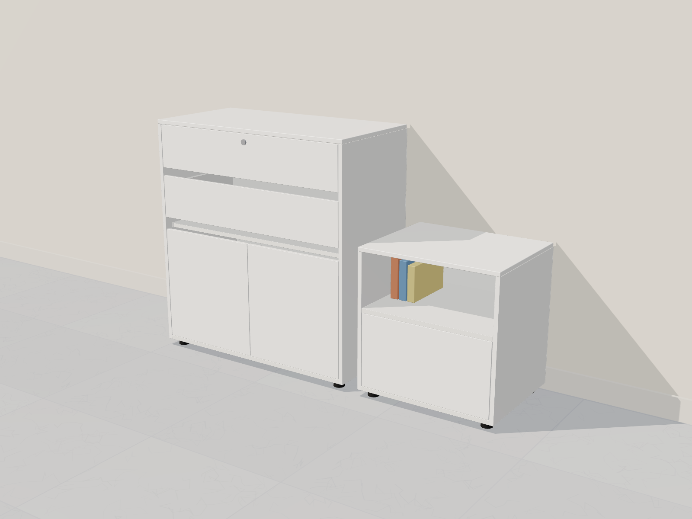
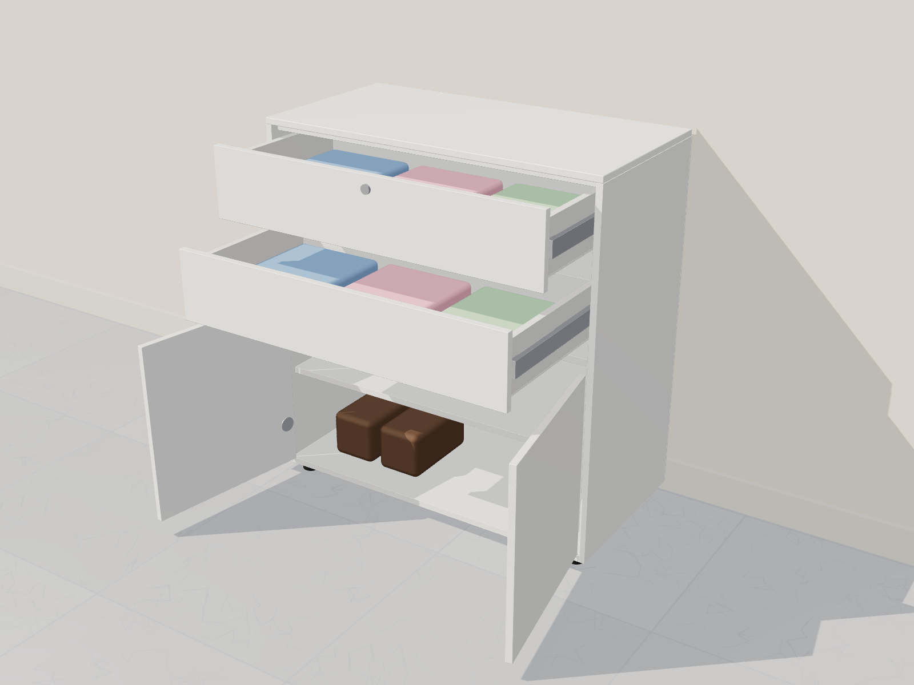
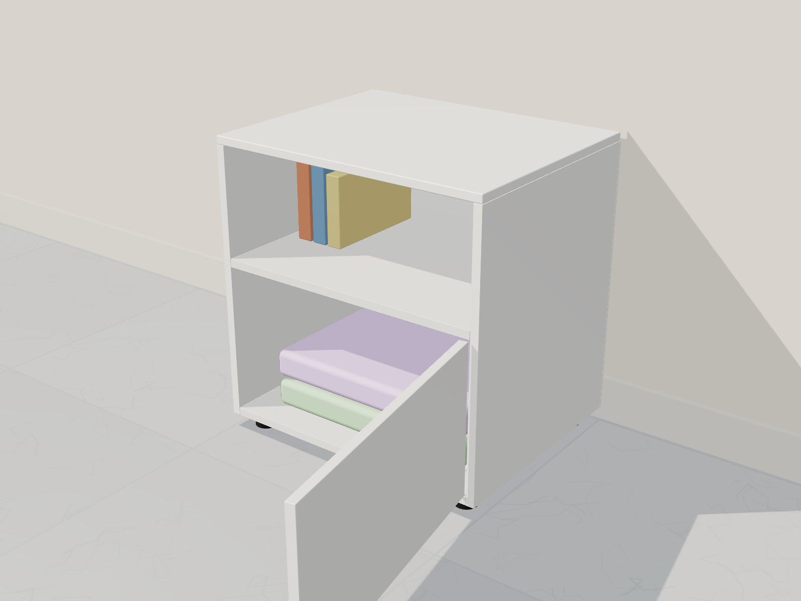

# Cómoda Turín + nochero Sleep: réplicas para fabricar con Madecentro

**📘 [manual-turin-sleep.pdf](manual-turin-sleep.pdf)** (11 páginas, A4): comparación de precio, compra,
plano de corte, piezas y cantos, **uniones (cómo se fija cada pieza y con qué herraje)**, perforaciones y
armado paso a paso.

| Original (Homecenter) | Medidas | Precio | Fabricado (estimado) |
|---|---|---|---|
| Cómoda Turín · Just Home Collection · cód. 628936 · 2 cajones + 2 puertas, frentes embutidos sin manijas, patas | 80 × 86 × 40 cm | $449.900 | **≈ $405.000** |
| Nochero Velador Sleep S-52 · Rta Design · cód. 677789 · nicho + 1 puerta embutida, patas | 50 × 52 × 40 cm | $174.900 | **≈ $130.000** |
| **Juego** | | **$624.800** | **≈ $535.000** (ahorro ≈ 14 %) |

- **1 lámina** melamina RH 15 mm 2,15 × 2,44 m ($266.410 blanca) para los dos: 28 piezas, 79 % de uso.
- **1 lámina** HDF 3 mm para los fondos y las bases de cajón.
- Uniones con tornillo de ensamble 6 × 2" (o minifix + tarugos como el original), rieles de 35 cm,
  bisagras codo (cierre lento en la cómoda, push-to-open en el nochero) y 8 patas.

| Juego | Cómoda abierta | Nochero abierto |
|---|---|---|
|  |  |  |

Modelo 3D: `../comoda-madecentro/fuente/scene.html?model=turin|sleep|set2&view=hero|open|front|color|step&step=1..6`.
El plano de corte se calcula con `fuente/despiece.py` y el manual se genera con `fuente/build.py`.
