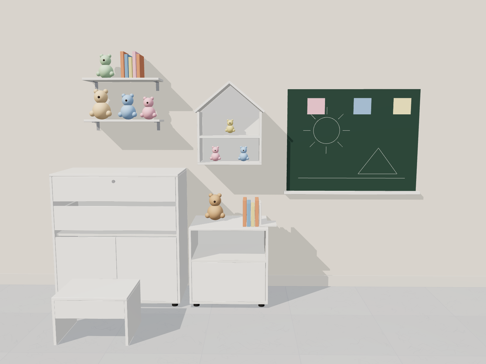
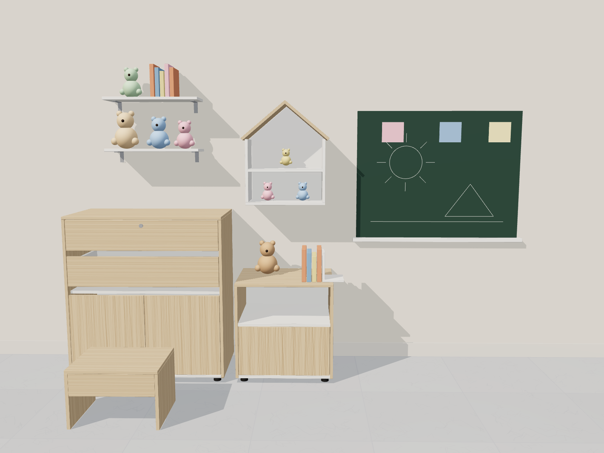
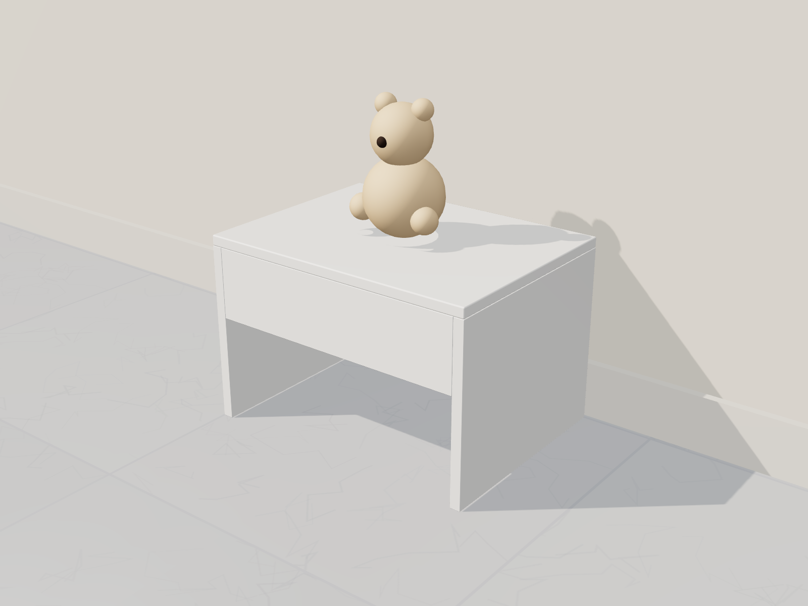
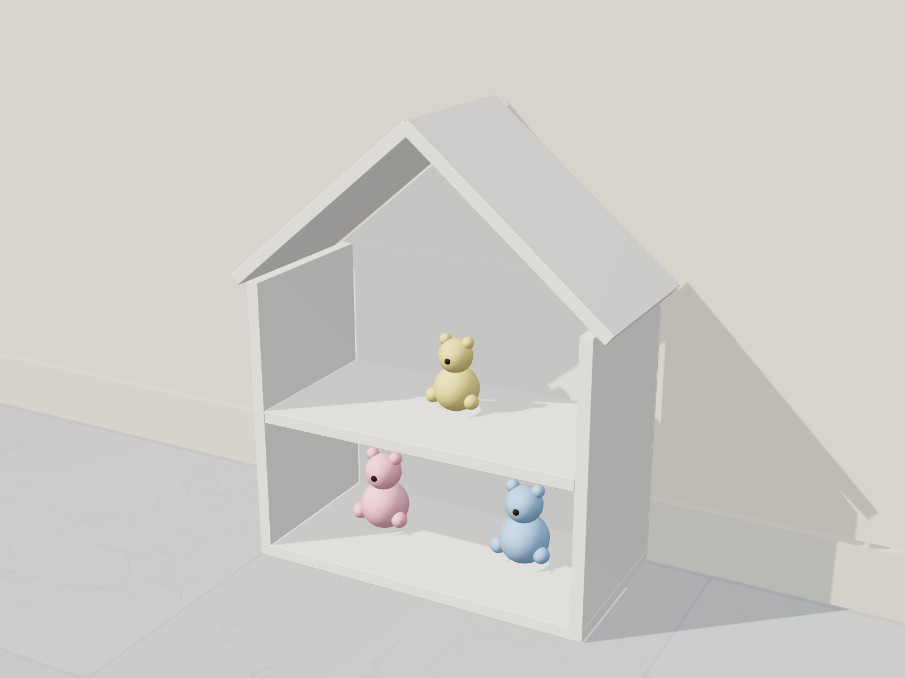
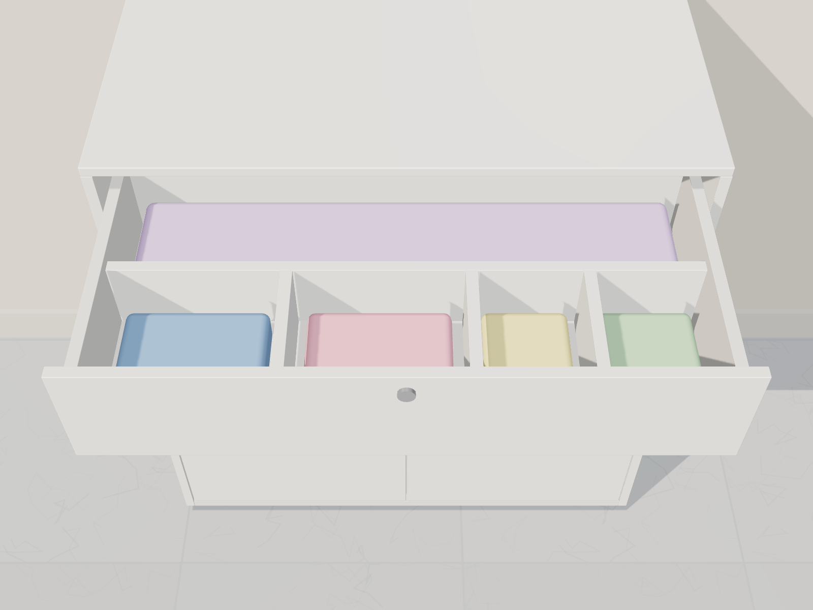

# Ideas con el sobrante (cómoda Turín + nochero Sleep)

Sobrante de la lámina de melamina 2,15 × 2,44: **834 × 683 mm**, 400 × 200, 768 × 97, 292 × 155 y tiras
de 344 / 247 / 230 × 110 mm. Del HDF: 1616 × 1326, 1112 × 480 y 800 × 278 mm.

> Pide estas piezas **en la misma orden de corte** de Madecentro para que salgan cortadas y con canto.
> El **banquito** y la **casita** salen del mismo retazo grande: elige uno de los dos.

| Cuarto completo | En madera clara |
|---|---|
|  |  |

## 1. Banquito escalón 40 × 26,5 × 30 cm (retazo 834 × 683)

| Pieza | Cant. | Medida (mm) | Canto |
|---|---|---|---|
| Tapa | 1 | 400 × 300 | 4 bordes |
| Lateral | 2 | 300 × 250 | 300 + 250 + 250 |
| Faldón (adelante y atrás) | 2 | 370 × 100 | 1 borde de 370 |

Se une con tornillo 6 × 2" (laterales a tapa desde arriba con tapatornillos, faldones entre laterales).

## 2. Casita repisa 42 × 53 × 20 cm (retazo 834 × 683, alternativa al banquito)

| Pieza | Cant. | Medida (mm) | Canto |
|---|---|---|---|
| Base | 1 | 420 × 200 | 420 |
| Pared | 2 | 330 × 200 | 330 |
| Entrepaño | 1 | 390 × 200 | 390 |
| Techo | 2 | 290 × 200 | 4 bordes (cortes a 40°) |
| Fondo HDF en forma de casita | 1 | 420 × 530 | — |

## 3. Divisores para el cajón de la cómoda (tiras de 97 y 110 mm)

| Pieza | Cant. | Medida (mm) |
|---|---|---|
| Divisor largo | 1 | 714 × 97 (de la tira 768 × 97) |
| Divisor corto | 3 | 153 × 97 (de las tiras de 110, rebajadas a 97) |

Van sueltos o fijos con 2 puntillas por extremo; la altura de 97 mm deja cerrar el cajón (caja de 110).

## 4. Repisas para peluches (retazo 400 × 200 + sobrante del grande)
2 repisas de 400–500 × 170 mm con escuadras metálicas a la pared (tornillo + taco).

## 5. Sujetalibros (retazo 292 × 155)
2 escuadras en L de 110 × 150 × 130 mm sobre el nochero.

## 6. Tablero para dibujar (HDF 1616 × 1326)
Corta 900 × 700 mm, pinta la cara blanca con **pintura de tablero** (o fórrala en corcho) y atorníllala a la pared
con una repisita de 40 mm abajo para las tizas.

Renders: `../../comoda-madecentro/fuente/scene.html?model=extras&view=room|color|banquito|casita|divisores`.
